<picture>
  <source media="(prefers-color-scheme: dark)" srcset="assets/npx-fangge-dark.svg">
  <source media="(prefers-color-scheme: light)" srcset="assets/npx-fangge-light.svg">
  
</picture>

### Hey, I'm Fangoooooo 👋

Full Stack Engineer at [MarsWave AI](https://github.com/marswaveai), building [ListenHub](https://listenhub.ai) — turn anything into podcasts, speech & video.

Previously Sr. Frontend Engineer at TikTok and DiDi.

```
npx fangge
```

`0x` prefix is not a typo. I like hex.
